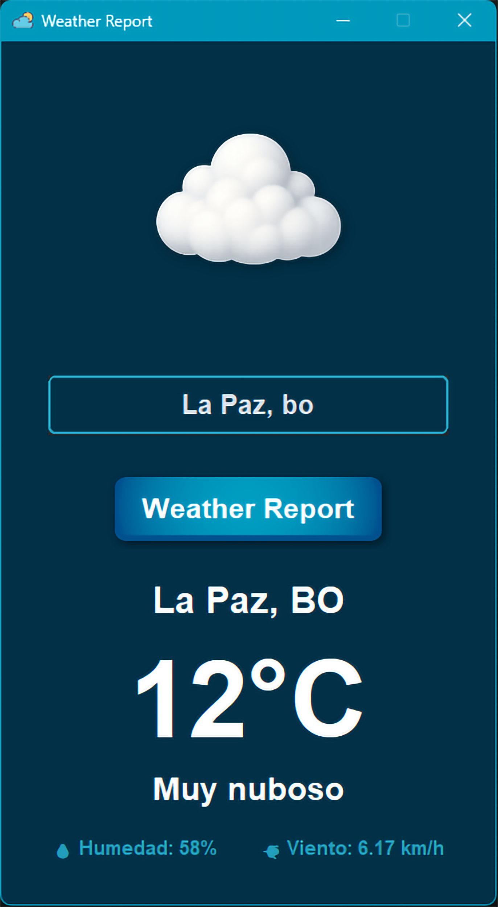

# 🌦️ Weather (Windows) — Professional Weather & Forecast Tool

Motor Meteorológico Asíncrono con Arquitectura Limpia y Distribución Firmada Digitalmente

### Herramienta Profesional de Consulta Meteorológica y Pronóstico Global de 5 Días


---
## 🧭 Descripción General

**Weather** es una aplicación de escritorio desarrollada en Python que proporciona datos meteorológicos en tiempo real y pronósticos extendidos de 5 días mediante la API de **OpenWeatherMap**

El proyecto ha sido diseñado bajo principios de ingeniería moderna:

    * Arquitectura desacoplada
    * Cliente HTTP asíncrono persistente
    * Modelos inmutables
    * Manejo de excepciones tipadas
    * Sistema de persistencia multiplataforma
    * Distribución portable firmada digitalmente

---

## 🚀 Características Nivel Elite

*   ✔ **Aplicación portable:** No requiere instalación (OneFile).
*   ✔ **Independencia total:** Funciona sin archivos externos obligatorios.
*   ✔ **Manejo avanzado de errores:** Diagnósticos claros de red y API (401, 404, 429, 500).
*   ✔ **Sistema de configuración jerárquico:** Prioriza Entorno > .env > Embebido.
*   ✔ **Compatible con ejecución desde USB:** Rutas dinámicas inteligentes.
*   ✔ **Caché persistente:** Respuestas instantáneas y ahorro de datos vía `weather_cache.json`.
*   ✔ **Seguridad:** API Key ofuscada y fragmentada en el binario.
*   ✔ **Resiliencia:** Timeouts optimizados y validación robusta de respuestas JSON.

---

## 📷 Previsualización y Estética

<p align="center">
  
</p>

---

## ✨ Características Principales

🌍 Motor Meteorológico Asíncrono

    * Cliente httpx.AsyncClient persistente (connection pooling)
    * Timeouts optimizados para entornos Windows
    * Manejo diferenciado de:  
     
        - 404 (ciudad no encontrada)
        - 429 (límite de API)
        - Errores de red
        - Errores HTTP
        - Fallos de infraestructura

🌐 Internacionalización (i18n) Soporte completo para 9 idiomas:

        * 🇪🇸 Español
        * 🇺🇸 Inglés
        * 🇫🇷 Francés
        * 🇩🇪 Alemán
        * 🇮🇹 Italiano
        * 🇵🇹 Portugués
        * 🇷🇺 Ruso
        * 🇯🇵 Japonés
        * 🇨🇳 Chino

    * Incluye:

        * Detección automática del idioma del sistema
        * Sistema de fallback seguro a inglés

🛡️ Seguridad y Distribución Profesional

    * API Key desacoplada del ejecutable
    * Variables de entorno priorizadas sobre .env
    * Ejecutable firmado digitalmente (SHA256)
    * Compatible con Windows SmartScreen
    * Build portable OneFile (PyInstaller)
---
---

## 🏛️ Arquitectura del Proyecto

Weather implementa un patrón **MVC (Modelo-Vista-Controlador)** desacoplado, facilitando la escalabilidad y el mantenimiento:

*   **Capa de Servicios (`services/`):** Orquestación de peticiones asíncronas a la API REST de OpenWeatherMap.
*   **Capa de Negocio (`core/`):** Gestión de estados, lógica de conversión de unidades y sistema de internacionalización.
*   **Capa de Interfaz (`ui/`):** Implementación de widgets personalizados, soporte High-DPI y efectos visuales de relieve.
*   **Gestión de Recursos:** Sistema de caché LRU para activos gráficos y motor de escalado dinámico para fuentes TTF.
---
```
Weather/
│
├── app/        → Configuración y constantes
├── core/       → Modelos, lógica de negocio, i18n, recursos
├── services/   → Cliente HTTP asíncrono y acceso a API
├── ui/         → Ventana principal y widgets personalizados
├── utils/      → Logger, validadores y utilidades
├── assets/     → Recursos gráficos e idiomas   
```
---
🔹 Principios Aplicados

    * Separación estricta de responsabilidades
    * Modelos inmutables (dataclass(frozen=True))
    * Cliente HTTP reutilizable
    * Caché LRU para imágenes
    * Cierre limpio del event loop
    * Logging rotativo industrial

---
## 🏗️ Infraestructura Técnica
```
| Componente   | Implementación                            |
| ------------ | ----------------------------------------- |
| Lenguaje     | Python 3.11+                              |
| UI           | Tkinter / CustomTkinter (HiDPI Optimized) |
| HTTP         | httpx (AsyncClient persistente)           |
| Imágenes     | Pillow (LRU Cache + soporte 4K)           |
| Logging      | RotatingFileHandler (2MB × 3 backups)     |
| Persistencia | JSON en AppData / Application Support     |
| Distribución | PyInstaller OneFile                       |
| Firma        | SHA256 Code Signing                       |

```
---

## 🚀 Descarga y Uso 

Weather se distribuye como un binario único (OneFile), eliminando la necesidad de instalaciones complejas.

### 1. Obtención del Software
1.  Accede a la sección oficial de [**Releases**](https://github.com/Pablitus666/Weather/releases).
2.  Descarga el archivo `Weather.exe` (Versión Portable).
3.  *(Opcional)* Descarga el certificado público para verificar la autenticidad.

### 2. Ejecución y Configuración
*   **Arranque:** Haz doble clic en el ejecutable. Al ser una versión portable, la aplicación extraerá sus recursos internos en un directorio temporal seguro antes de iniciar.
*   **Uso:** Ingresa el nombre de la ciudad en el campo de búsqueda y presiona **Enter** o el botón de búsqueda.

### 3️. Configuración de API (Para desarrolladores)

Establecer variable de entorno:
```
setx OPENWEATHER_API_KEY "TU_API_KEY"
```
O crear archivo .env externo:
```
OPENWEATHER_API_KEY=TU_API_KEY
```
---

## 🛡️ Verificación de Firma Digital

    * Clic derecho sobre Weather.exe
    * Propiedades
    * Pestaña “Firmas digitales”
    * Verificar que el estado sea “Firma válida”

Esto confirma:

    * Integridad
    * Autenticidad
    * Ausencia de manipulación

*Este procedimiento confirma que el ejecutable es original y libre de inyecciones maliciosas de terceros.*

---

## 📷 Capturas de Pantalla

<p align="center">
  
</p>

---
## 🧪 Calidad y Testing

    * Suite automatizada con pytest
    * Mock de cliente HTTP
    * Validación de lógica de negocio
    * Manejo de errores cubierto
    * Cierre limpio de recursos asíncronos

---
## 📈 Roadmap

    * Sistema de actualización automática
    * Instalador profesional (Inno Setup)
    * Pipeline CI/CD
    * Métricas de cobertura con coverage.py
    * Soporte multiplataforma completo (macOS / Linux)

---


## 🧰 Stack Tecnológico

*   **Lenguaje:** Python 3.11+
*   **Framework UI:** CustomTkinter / Tkinter (HiDPI Optimized)
*   **Procesamiento de Imagen:** Pillow (PIL) con efectos de sombra y relieve.
*   **Red:** Requests con gestión de timeouts y excepciones.
*   **Distribución:** PyInstaller (CArchive/OneFile) y PowerShell para firma SHA256.

---
## 🧭 Evolución: Versión Legacy

Weather representa la evolución profesional de un script experimental previo. La versión Legacy permanece disponible con fines educativos.
👉 [**Weather — Legacy Edition**](https://github.com/Pablitus666/Weather---Legacy.git)

--- 

## 👨‍💻 Autor y Soporte

**Walter Pablo Téllez Ayala**  
Software Developer  

📍 Tarija, Bolivia  <br>
📧 [pharmakoz@gmail.com](mailto:pharmakoz@gmail.com) 

© 2026 — Weather Tool

---

⭐ **¿Te gusta este proyecto?** Dale una estrella en el repositorio oficial para apoyar el desarrollo de software de código abierto de calidad: [**Weather Repo**](https://github.com/Pablitus666/Weather.git)
